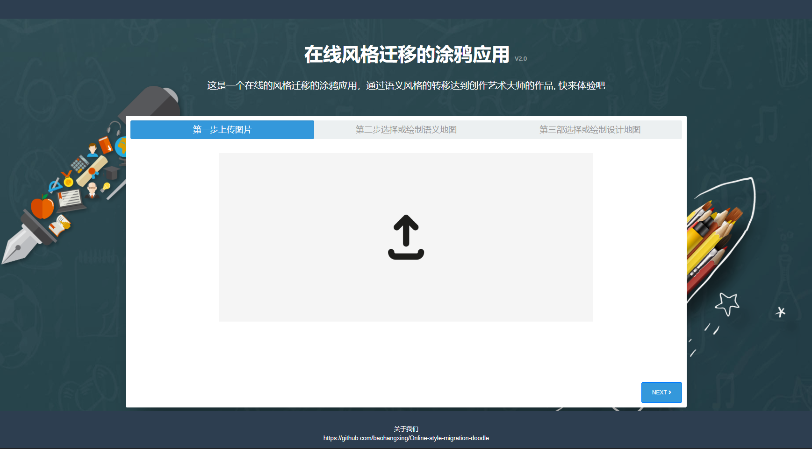

# Online style migration doodle 在线风格迁移的涂鸦应用

## Describe

This is a web application under [the project (Neural Doodles:
Workflows for the Next Generation of Artists)](https://nucl.ai/blog/neural-doodles/)

## Show

index Page:


start Page:


GIF :


### How to use it

pytorch 
```angular2
numpy>=1.14.2
torch>=0.4.0
torchvision>=0.2.1
tqdm>=4.23.1
Pillow>=5.1.0
```

中国用户安装建议使用清华大学的流以避免不必要的麻烦 
[->步骤详细](https://blog.csdn.net/zzq060143/article/details/88042075)

>conda config --add channels https://mirrors.tuna.tsinghua.edu.cn/anaconda/pkgs/free/
>
>conda config --add channels https://mirrors.tuna.tsinghua.edu.cn/anaconda/pkgs/main/
>
>conda config --set show_channel_urls yes
>
>conda config --add channels https://mirrors.tuna.tsinghua.edu.cn/anaconda/cloud/pytorch/
>
>conda install pytorch torchvision cudatoolkit=10.0


run flask server
```shell
run hello.py
```

## Features

- upload your image or paint by yourself

- more style migration functions in .ipynb, you can add them in your web

## Recommended to read

- [论文|结合马尔科夫随机场和卷积神经网络的图像合成](https://zhuanlan.zhihu.com/p/25742298)

- [Neural Doodles:
Workflows for the Next Generation of Artists
by Alex J. Champandard  on  March 7, 2016](https://nucl.ai/blog/neural-doodles/)

- [模型参考](https://github.com/cheind/py-style-transfer)
