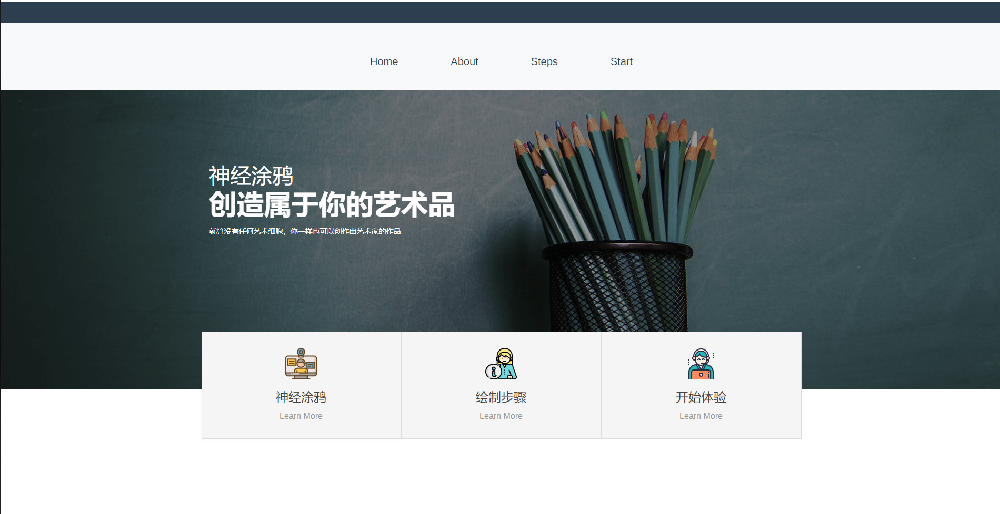

## Online style migration doodle

在线风格迁移的涂鸦应用

This is a web application under [the project (Neural Doodles:
Workflows for the Next Generation of Artists)](https://nucl.ai/blog/neural-doodles/)

like this:


...
GIF :


### How to use it

pytorch 
```angular2
numpy>=1.14.2
torch>=0.4.0
torchvision>=0.2.1
tqdm>=4.23.1
Pillow>=5.1.0
```


中国用户安装请使用清华大学的流以避免不必要的麻烦 
[->步骤详细](https://blog.csdn.net/zzq060143/article/details/88042075)

>conda config --add channels https://mirrors.tuna.tsinghua.edu.cn/anaconda/pkgs/free/
conda config --add channels https://mirrors.tuna.tsinghua.edu.cn/anaconda/pkgs/main/
conda config --set show_channel_urls yes
conda config --add channels https://mirrors.tuna.tsinghua.edu.cn/anaconda/cloud/pytorch/
conda install pytorch torchvision cudatoolkit=10.0


### License

```
Copyright 2019 baohangxing 

Permission is hereby granted, free of charge, to any person obtaining a copy of this software and
associated documentation files (the "Software"), to deal in the Software without restriction,
including without limitation the rights to use, copy, modify, merge, publish, distribute, sublicense
and/or sell copies of the Software, and to permit persons to whom the Software is furnished to do so
subject to the following conditions:

The above copyright notice and this permission notice shall be included in all copies or substantial
portions of the Software.

THE SOFTWARE IS PROVIDED "AS IS", WITHOUT WARRANTY OF ANY KIND, EXPRESS OR IMPLIED, INCLUDING BUT
NOT LIMITED TO THE WARRANTIES OF MERCHANTABILITY, FITNESS FOR A PARTICULAR PURPOSE AND
NONINFRINGEMENT. IN NO EVENT SHALL THE AUTHORS OR COPYRIGHT HOLDERS BE LIABLE FOR ANY CLAIM, DAMAGES
OR OTHER LIABILITY, WHETHER IN AN ACTION OF CONTRACT, TORT OR OTHERWISE, ARISING FROM, OUT OF OR IN
CONNECTION WITH THE SOFTWARE OR THE USE OR OTHER DEALINGS IN THE SOFTWARE.
```